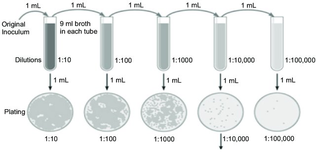
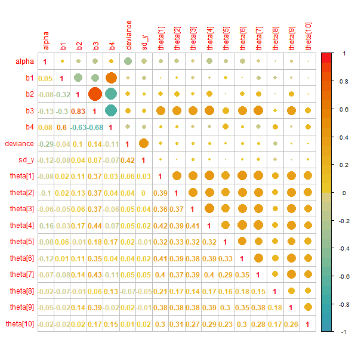

```{r setup, include=FALSE}
knitr::opts_chunk$set(echo = TRUE)
```

## Summary

Serial dilution assay is a technique for estimating concentration of compounds, based on combining measurements of several different dilutions of a unknown sample.
The relation between concetrations and measurements is non linear and therefore it is not suitable to weight the measurements equally. We use a Bayesian approach for estimating jontly the calibration curve and the unknown concentrations. In particular, we set up two models: the first model assumes that measurements are _homoscedastic_ with respect to concentration. We will see how this model is not able to estimate too small concentrations. The second model drops this assumption and, compared to the first, estimates have much lower standard errors and give results for any concentration. We test the ability of our models to recover models parameters simulating data from the models it self. Finally, we compare the Bayesian approach with the frequentist one, concluding that Bayesian estimates are much more accurate than those obtained by the frequentist method.


## Introduction 
 
A common approach for estimating concentrations of compounds in biological samples is the _serial dilution assay_, in which a small amount of sample or solute are serially diluted, mixing a amount of sample with a measured amount of a inert liquid.
Then for each diluted samples we take a measurement. The reason for the serial dilutions of each sample is that the concentration in a assay is quantified by an automated optical reading of a color change, and there is only a certain range of concentrations for which the color change is informative: at low values of concetration the color change is imperceptible, at high values the color saturates. Hence, different dilutions give several opportunities for an accurate measurement. Or better, different dilutions give measurements with different accuracy. 

<center>

{#id .class width=50% height=50%}

```{r package, echo = FALSE, include=FALSE, warning = FALSE}
library(knitr,quietly = TRUE)
library(corrplot,quietly = TRUE)
library(easynls,quietly = TRUE)
library(bayesboot,quietly = TRUE)
#library(CalvinBayes)
library(R2jags,quietly = TRUE)
library(dplyr,quietly = TRUE)
library(ggplot2,quietly = TRUE)
library(ggmcmc,quietly = TRUE)
library(kableExtra, quietly = TRUE)
library(LaplacesDemon)

set.seed(19121961)
```

```{r table1, echo = FALSE}
d_unk_sample <- c("1", "1", "1/3","1/3", "1/9", "1/9", "1/27", "1/27")
d_std_sample <- c("1", "1/2", "1/4", "1/8", "1/16", "1/32", "1/64","0")

std <- matrix(d_std_sample, nrow=8, ncol = 2, dimnames = list(NULL, c(rep("std",2))))
unk <- matrix(d_unk_sample, nrow = 8, ncol = 10,dimnames = list(NULL, c(rep("unk",10))))
dil <- cbind(std, unk)

kable(booktabs = T, dil, digits = 3, format = "latex", caption = 'Setup of a plate with 96 wells. The first two columns are dilutions of "Standards" (sample known concentrations), and the other column are 10 different "Unknowns". The goal of the assay is to estimate the concentrations of the"Unknowns", using the "Standards" as calibration.')
```


## Data 

An assay comes on plate with a number of wells each containing a sample at a specific dilution. Dilution levels in a plate are show in Table 1, where each cell represent a well. The plate contains two type of data: the _Unknowns_, which are the samples for which we want estimates the concentration, and the _Standards_, which are compound for which the concentration is known and used to calibrate the measurements.

The data used in the experiment comes from a single plate with 96 wells in a study of cockroach allergens in the homes of a asthma sufferers. In Table 2 shows the data for the _Standards_ (having know concentration of 0.64), within its measurements at several dilutions, and data for two _Unknowns_. Dilutions for _Standards_ range from 1 to 0 (the numbers in Table 1). Dilution equal to 1 means no dilution (sample at full strenght), dilution equal to 0 means solution is made by 100% of inert liquid and 0% of sample.

The goal of the project is to estimates the concentration for the _Unknowns_ samples, using _Standards_ as calibration.

```{r table2, echo = FALSE}

data <- read.table("dilution.dat", 
                   header=FALSE, skip=4)

y <- data$V1 # optical measurements

n_unk <- 10 

y_unk <- y[1:80]

y_standard <- y[81:96]

d_unk_sample <- c("1", "1", "1/3","1/3", "1/9", "1/9", "1/27", "1/27")
d_std_sample <- c("1", "1/2", "1/4", "1/8", "1/16", "1/32", "1/64","0")
dilution_std <- rep(d_std_sample, each = 2)

d_standard <- rep(c(1, (1/2), (1/4), (1/8), (1/16), (1/32), (1/64),0), each = 2)
x_standard <- 0.64 * d_standard

sample_name <- c(c("Unknown 8", rep("",7)) , c("Unknown 9", rep("",7)))
df_std <- data.frame("Dilution" = dilution_std, "Diluted Conc." = x_standard,"y" = y_standard)
df_unk <- data.frame(
  "Sample" =sample_name, "Dilution" = rep(d_unk_sample,2), "y" = y[57:72]
)


std <- matrix(d_std_sample, nrow=8, ncol = 2, dimnames = list(NULL, c(rep("std",2))))
unk <- matrix(d_unk_sample, nrow = 8, ncol = 10,dimnames = list(NULL, c(rep("unk",10))))

#k <- kable(dil, digits = 3, format = "latex", caption = "Table 1")
#kable(list(df_std, df_unk), digits = 3, format = "latex", caption = "Measurements")

data_df <- cbind(df_std, df_unk)

data_df %>%
  kbl(booktabs = T,caption = 'Example of some measurements y from a plate. On the left measurements y for "Standards" (sample with known concetration of 0.64). On the righ measurements y for two "Unknowns" ("Unknown 8" and "Unknown 9") for which we want estimate the concetration.') %>% 
  kable_classic_2(full_width = F) %>%
  add_header_above(c("Standards data " = 3, "Some of Unknowns data" = 3))

# kables(list(kable(df_std, digits = 3,format = "latex"), kable(df_unk,format= "latex")),
#        caption = 'Example of measurements y from a plate. On the left the "Standards" (sample with known concetration of 0.64). On the righ the measurements y for two "Unknowns" ("Unknown 8" and "Unknown 9") for which we want estimate the concetration.')
```


```{r, echo = FALSE}
# plot data ---------------------------------------------------------------

data <- read.table("dilution.dat", 
                   header=FALSE, skip=4)

y <- data$V1 # optical measurements

d_unk_sample <- c(1, 1, (1/3), (1/3), (1/9), (1/9), (1/27), (1/27))

d_unk <- rep(d_unk_sample, 10) # dilution of unknows 

d_standard <- rep(c(1, (1/2), (1/4), (1/8), (1/16), (1/32), (1/64),0), each = 2)

labels <- c(rep(paste("Unknown", seq(1,10)), each = 8), rep("Standards data", 16))

data_plot <- data.frame(dilution = c(d_unk, d_standard),y,labels)

ggplot(data_plot, aes(x = dilution, y = y)) +
  geom_point(shape = 1) + 
  facet_wrap(~labels) + 
  labs(caption = "Figure 1: Data of measurements versus dilutions from a single plate.")


```

## Model Structure

We use the following notation:

* $y_i$ for observed measurement (color intesities)
* $\theta_j$ for the concetration of the samples (for the standard sample $j = 0$ and $\theta_{0} = 0.64$)
* $d_i$ level of dilution (the column _Dilution_ in Table 2)
* $x_i$ for the diluted concentration, that is $x_i = d_i \cdot \theta_j$

Thus, the goal is to estimates the concentration $\theta_j$ for the _Unknowns_.

The _expected value_ of the measurement y is a function of the (diluted) concentration $x$ and typically a four-parameter logistic curve is used: 


$$
\large
E(y|x,\beta) = g(x,\beta) = \beta_1 + \frac{\beta_2}{1 + (x/ \beta_3)^{-b4}}
$$
where $\beta_1$ is the color intensity y at zero concentration, $\beta_2$ is the increase to saturation (y max is $\beta_1 + \beta_2$), $\beta_3$ is the concentration at which the curve turns, and $\beta_4$ is the rate at which saturation occurs. 

All the four parameters $\beta_k$, as well as concentrations $\theta$ are positive, so we model them on a logarithmic scale. 

```{r, echo = FALSE}

# 4-parameters logist function
theta.std <- 0.64
expect_value <- function(x, beta_param) {
  b1 = beta_param[1]
  b2 = beta_param[2]
  b3 = beta_param[3]
  b4 = beta_param[4]
  out <- ( b1 + b2/( 1 + (x/b3)^(-b4)  )  )
  return(out)
}

plot(x_standard, y_standard, col = 'purple', pch = 5, main = "Standards",
     xlab = "diluted concentrations", ylab = "measurements", sub = "(The curve shown are estimated from the model described later.)", cex.sub = .75)
beta_cheat <- c(14.71, 99, 0.05, 1.35) # estimates obtained later (using by complex model) hard coded to make plot here. 
curve(expect_value(theta.std*x, beta_param = beta_cheat),
      lty = 1, col = "dodgerblue4", lwd = 3, add = T)
legend("bottomright",c('standards data','4p Logistic curve'),lty=c(NA,1),pch=c(5,NA), pt.bg=c("purple", NA), bty='n', col = c("purple",'dodgerblue4'), lwd =c(1,3))
text(0, 104,adj = c(0,0), expression(y == beta[1] + frac(1, beta[2] + (x/beta[3])^(-beta[4])  ) ),
     cex = .9, col = "darkblue")

```

## Model 1: equal variance 

We model the measurement as normally distributed with equal variances:

$$
\Large y_i \sim N(g(x_i,\beta), \sigma^{2}_{y})
$$
$$
\Large x_i = d_i \cdot \theta_j
$$


#### Prior distribution 


We assign non informative prior distributions:

* for the parameters of the curve: $log(\beta_{k}) \sim Unif(-\infty, +\infty) \text{ for k = 1, 2, 3, 4}$.

* InvGamma prior distribution for $\sigma^{2}_{y}$, that is a Gamma distribution for the precision $\sigma^{2}_{y} = \frac{1}{\tau}, \tau \sim Gamma(0.001, 0.001)$.

* for the unknown concentrations: $log(\theta_j) \sim Unif(-\infty, +\infty)$.

#### Inference

We fitted the model in RJAGS. The definition of the model is stored on the \verb|simple_model.txt| file but it is reported here as well.

We actually work we parameters $log(\beta)$, $\sigma^{2}_{y}$, and $log(\gamma)$ where $log(\gamma_i) = log(\theta_j / \beta_3)$. The use of $\gamma_i$ in place of $\theta_j$ gets around the problem of the strong correlation between the unknown concentrations and the parameter $\beta_3$.

```{model 1, eval = FALSE}
# equal variance model  

model{
  
  for (i in 1:(zero_conc_from - 1) ) {
    
    y[i] ~ dnorm(expect[i], prec[i])   
    
    expect[i] <- exp(logb1) + ( (exp(logb2)) /  (1 + pow(d[i]*exp(loggamma[index[i]]) , -exp(logb4)) ) )
    
    prec[i] <- precision_y
  } 
  
  # if the dilution coeff. d_i is 0 then E[y|x] = beta_1
  
  for (i in zero_conc_from : zero_conc_to) {
    
    y[i] ~ dnorm(expect[i], prec[i])
    
    expect[i] <- exp(logb1) 
    
    prec[i] <- precision_y
  }  
  
  for (j in 1:11) {
    loggamma[j] ~ dunif(-1000,1000)	
  }
  
  # priors
  logb1 ~ dunif(-1000,1000)
  logb2 ~  dunif(-1000,1000)  
  logb4~ dunif(-1000,1000)
  
  precision_y ~ dgamma(0.001, 0.001) 
  
  # transformation to orginal scale
  b1 <- exp(logb1)
  b2 <- exp(logb2)
  b4 <- exp(logb4)
  
  b3 <- 0.64/exp(loggamma[11])
  sd_y <- 1 / sqrt(precision_y)
  
  for (j in 1:11) {
    theta[j] <- exp(loggamma[j]) * b3
  }
}

```

As starting point for JAGS we used the Non Linear Lest Square (NLS) estimates of the parameters computed in Section "Frequentist".

We obtained convergence (the potential reduction factors R were below 1.1) after 50 000 interations of two parallel chains. To save memory we save every 20 th iteration of each chain, to have in the end 1250 samples per chain.


```{r init, include = FALSE}

data <- read.table("dilution.dat", 
                   header=FALSE, skip=4)

y <- data$V1 # optical measurements

n_unk <- 10 

y_unk <- y[1:80] # optical measurements unknowns

y_standard <- y[81:96] # optical measurements standards

d_unk_sample <- c(1, 1, (1/3), (1/3), (1/9), (1/9), (1/27), (1/27))# dilutions unknown

d_unk <- rep(d_unk_sample, 10) # dilutions unknowns

d_standard <- rep(c(1, (1/2), (1/4), (1/8), (1/16), (1/32), (1/64),0), each = 2) # dilutions standards

index <- rep(c(seq(1,11) ,11), each=8)
d <- c(d_unk, d_standard)
dataset <- cbind(d,y,index)
zero_conc_index <- which(dataset[,"d"] == 0) # indeces of samples at zero conc.
zero_conc_from <- zero_conc_index[1] # first index of samples at zero conc.
zero_conc_to <- zero_conc_index[length(zero_conc_index)] # last index of samples at zero conc.

```

```{r simple fit, echo = FALSE}

# data to Jags 

dat.jags <- list("y", "d", "index", "zero_conc_from", "zero_conc_to")

# model parameters 

mod.params <- c("b1", "b2","b3","b4","sd_y", "theta")

# Starting values

mod.inits <- function(){
  list("logb1" = log(15),
       "logb2"= log(108), "logb4"=log(1.12),"precision_y"=0.003 ,"loggamma" = rep(1, 11))
}


# Run JAGS

mod.fit.simple <- jags(data = dat.jags,
                       model.file = "simple_model_2.txt", inits = mod.inits,
                       parameters.to.save = mod.params,
                       n.chains = 2, n.iter = 50000, n.thin=20)
mod.fit.simple
```

``` {r, include =FALSE}
mod.simple.mcmc <- as.mcmc(mod.fit.simple)
chain_array_df_s <- ggs(mod.simple.mcmc)
```

We note how the estimate for "theta 8" (concentration of "Unknown 8") is zero. A casual glance at the data, (see Unknown 8 in Figure 2) might suggest that these data are all noise (the curve that interpolates the data is quite flat), and we therefore we could conclude that concentration is zero. However, a carefull look at the numbers reveals that the measurements decline consistently from concentration of 1 to 1/3 to 1/9 (see Table 2), with only the final dilutions lost in noise (the measurements at 1/27 are indeed no lower that at 1/9).

In measurements of allergens, even low concentration can be important for asthma sufferers, and we need to be able to distinguish between zero concentrations and values that are merely low.


### Converge Diagnostic

Once the samples from the _posterior distributions_ are obtained, **the convergence check is needed**. If the Markov Chians converges, it means it has reached its equilibrium (target) distribution and the generated samples comes from the target distribution. Hence, monitoring the convergence of the algorithm is essential for producing results from the posterior distribution.

##### Trace plots 

Trace plots show the values the parameter took during the runtime of che chain.
If the samples comes from the same distribution, the trace plots of different chains (that are show with different colour) mix with each other. It seems our case. Moreover, the range of values is not too wide.

Again, we see how the plot seems suitable for all variables, except concentration of "Unknown 8."

```{r, include = FALSE}
indx_theta_simple <- grep("theta", colnames(mod.fit.simple$BUGSoutput$sims.matrix))
theta_name <- colnames(mod.fit.simple$BUGSoutput$sims.matrix)[indx_theta_simple]
```

```{r trace plot, echo = FALSE}
par(mfrow= c(3,3), mgp=c(1.5,.7,0), oma = c(0,0.5,0,0), mar = c(2.5,1,3.1,1))
coda::traceplot(mod.simple.mcmc)
```


#### Density Plot 

In the following graphs, we compare the density coming from last part of the chain (the last 50 percent of the values, in green) with the whole chain (black), where the two columns refers to the two chains. Ideally, the initial and final parts of the chain have to be sampling in the same target distribution, so the overlapped densities should be similar. As before, we note that the graphs are reassuring, except for Unknown 8. 


```{r, echo = FALSE}

p1 <- ggs_compare_partial(chain_array_df_s %>% filter(Parameter %in% c('b1','b2','b3','b4')),
                          partial = 0.5) + theme_minimal() 

p2 <- ggs_compare_partial(chain_array_df_s %>% filter(Parameter %in% theta_name[1:4]),
                          partial = 0.5) + theme_minimal() 

p3 <- ggs_compare_partial(chain_array_df_s %>% filter(Parameter %in% theta_name[5:7]),
                          partial = 0.5) + theme_minimal() 
p4 <- ggs_compare_partial(chain_array_df_s %>% filter(Parameter %in% theta_name[8:10]),
                          partial = 0.5) + theme_minimal() 
p1
p2
p3
p4

```


### Prediction 

The model used is not able to make inferences on Unknown 8, even if informations seems to be present in the data which decline consistently with dilution.
In order to find the weak point of the model, we check its prediction ability, comparing predictions of the model on _y_ with the measurements. 

Recall that for each level of dilution two measurements are provided (see Table 2).
In Figure 2 we try to predict the values of _y_ accroding to our model, and we compare them with the data showed before in Figure 1.
Looking at the plot in Figure 1, we note that, as the dilution level increases, there is more dispersion in the measurements than in our prediction, (the plot for measurements has the shape of a funnel). This is a clear signal that the variability of the random disturbance is different across measurements and we should taking in to account. Therefore we drop our assumption that the modelling errors all have the same variance. 


```{r, include = FALSE}
# 4-parameters logist function

expect_value <- function(x, beta_param) {
  b1 = beta_param[1]
  b2 = beta_param[2]
  b3 = beta_param[3]
  b4 = beta_param[4]
  out <- ( b1 + b2/( 1 + (x/b3)^(-b4)  )  )
  return(out)
}
```

```{r include=FALSE}
idx_simple <- grep("theta", colnames(mod.fit.simple$BUGSoutput$sims.matrix))

theta_chains_estimate <- mod.fit.simple$BUGSoutput$sims.matrix[,idx_simple]

theta_mean <- colMeans(theta_chains_estimate)

# point estimates beta  ---------------------------------------------------


indx_beta <- grep("b", colnames(mod.fit.simple$BUGSoutput$sims.matrix))

beta_chains.simple <- mod.fit.simple$BUGSoutput$sims.matrix[,indx_beta]

beta.hat.s <- colMeans(beta_chains.simple)

beta.hat.s

# point estimate sigma y --------------------------------------------------

idx_sd <- grep("sd", colnames(mod.fit.simple$BUGSoutput$sims.matrix))

sd_chains_estimate <- mod.fit.simple$BUGSoutput$sims.matrix[,idx_sd]

sd.y.hat <- mean(sd_chains_estimate)

```

```{r include=FALSE}

sample_unk <- rep(seq(1,10), each=8)

estimate_conc <- theta_mean * d_unk 

#round(cbind(d_unk,y_unk,sample_unk,est_concentration),3)

cond_expect <- expect_value(estimate_conc, beta_param = beta.hat.s)

y_unk_pred <- rep(NA, length(y_unk)) 

for (i in 1 : length(y_unk)){
  x <- theta_mean[sample_unk[i]] * d_unk[i]
  mean_y <- expect_value(x = x, beta_param = beta.hat.s)
  samples_y <- rnorm(n = 10000, mean = mean_y, sd = sd.y.hat)
  y_unk_pred[i] <- mean(samples_y)
}

```

```{r include=FALSE}
prediction.s <- as_tibble(cbind(d_unk,estimate_conc,y_unk_pred,y_unk,sample_unk))
prediction.s %>% filter(sample_unk == 8)
prediction.s.pivoted <- prediction.s %>% 
  pivot_longer(
    c(y_unk_pred, y_unk),
    names_to = c("type"),
    values_to = "y") 

prediction.s.pivoted <- prediction.s.pivoted %>% mutate("label" = paste("Unknown", sample_unk))

grouped <- rbind(prediction.s.pivoted , prediction.s.pivoted %>% filter (d_unk == 1/9 | d_unk == 1/3))

grouped <-grouped %>% mutate("group"=paste(type, rep(seq(1,30), each = 8)))

#prediction.s.pivoted <- prediction.s.pivoted %>% mutate("label" = paste("Unknown", sample_unk)) %>% mutate("group"=paste(type, rep(seq(1,20), each = 8)))
```


```{r echo=FALSE, warning=FALSE}

ggplot(grouped %>% filter(sample_unk == 1 |sample_unk == 8 | sample_unk == 9), mapping = aes(x = d_unk, y = y, col = type)) + 
  geom_point() +
  geom_polygon(alpha = 0.3, linetype=1, aes(fill = type,group = group, col = type)) + 
  facet_wrap(~ label, 3,1,strip.position='left') + 
  scale_colour_discrete(name = "y", breaks = c("y_unk","y_unk_pred"), labels = c("data", "prediction")) +
  scale_fill_discrete(name = "y", breaks = c("y_unk","y_unk_pred"), labels = c("data", "prediction")) + 
  labs(title="Examples of comparison between data and prediction",
       x ="dilution", y = "y", caption = "Figure 2. For each level of dilution we have two measures.\n However, data (pink) appear very spaced, while predictions (lightblue) \n are so close that they quite coincide.")


```


### Model 2: unequal variance 

In this section, we follow *Higgins et al. (1998)* model the measurement error as normally distributed with unequal variances:


$$ 
\Large y_i \sim N\left( g(x_i,\beta), \left( \frac{g(x_i,\beta)}{A}  \right)^{2 \alpha}  \sigma^{2}_{y} \right), \\ \quad
\Large x_i = d_i \cdot \theta_j
$$

where:

* the parameter $\alpha > 0$ models the pattern that variances are higher for larger measurements.

* the constant $A$ is arbitrary and is set to some value in the middle of the range of the data (we set to the geometric mean). It is included so that the parameter $\sigma_y$ has a more direct interpretation as the standard deviation of a "typical" measurement.


#### Prior 

For the parameters $\beta$,  $\sigma^{2}_{y}$ and for the unknown concentrations $\theta$ we use a non informative prior distributions, as did before. For the parameter $\alpha$ we assign a uniform prior distribution in the range $[0, 2]$. To summarize:

* $log(\beta) \sim Unif(-\infty, +\infty) \text{ for k = 1, 2, 3, 4}$.

* $\sigma^{2}_{y} = \frac{1}{\tau}, \tau \sim Gamma(0.001, 0.001)$.

* $log(\theta_j) \sim Unif(-\infty, +\infty)$.

* $\alpha \sim Unif(0, 2)$.

#### Inference 

We fit the following model in JAGS. We obtain converges (R < 1.1) for all the paramenters after 50 000 iterations of two parallel chains.

```{r eval = FALSE}
model{
  
  for (i in 1: (zero_conc_from - 1) ) {
    
    y[i] ~ dnorm(expect[i], prec[i])   
    
    expect[i] <- exp(logb1) + ( (exp(logb2)) /  (1 + pow(d[i]*exp(loggamma[index[i]]) , -exp(logb4)) ) )
    
    prec[i] <- ((A/expect[i])^(2*alpha)) * tau_y 
  } 
  
  for (i in zero_conc_from : zero_conc_to) {
    
    y[i] ~ dnorm(expect[i], prec[i])
    
    expect[i] <- exp(logb1) 
    
    prec[i] <- ((A/expect[i])^(2*alpha)) * tau_y 
    
  }  
  
  for (j in 1:11) {
    loggamma[j] ~ dunif(-1000,1000)	
  }
  
  # priors
  logb1 ~ dunif(-1000,1000)
  logb2 ~ dunif(-1000,1000)  
  logb4 ~ dunif(-1000,1000)
  
  tau_y ~ dgamma(0.001, 0.001) 
  
  alpha ~ dunif(0,1)
  
  # transformation to orginal scale
  b1 <- exp(logb1)
  b2 <- exp(logb2)
  b4 <- exp(logb4)
  
  b3 <- 0.64/exp(loggamma[11])
  
  sd_y <- 1/sqrt(tau_y)
  
  
  for (j in 1:10) {
    theta[j] <- exp(loggamma[j]) * b3
  }
}
```


```{r include = FALSE}
y <- data$V1 

d <- c(d_unk, d_standard)

index <- rep(c(seq(1,11) ,11), each=8)

dataset <- cbind(d,y,index)

zero_conc_index <- which(dataset[,"d"] == 0)
zero_conc_from <- zero_conc_index[1];
zero_conc_to <- zero_conc_index[length(zero_conc_index)]


gm_mean = function(x, na.rm=TRUE){
  exp(sum(log(x[x > 0]), na.rm=na.rm) / length(x))
}

A <- round(gm_mean(y))
```


```{r }

A <- round(gm_mean(y))

dat.jags <- list("y", "d", "index","A", "zero_conc_from", "zero_conc_to")

mod.params <- c("b1", "b2","b3","b4", "theta", "alpha","sd_y")

# Starting values
mod.inits <- function(){
  list("logb1" = log(15),
       "logb2"= log(108), 
       "logb4"=log(1.12),
       "tau_y"=0.03,
       "alpha" = 0.5,
       "loggamma" = rep(1, 11)
  )
}

# Run JAGS

mod.fit.complex <- jags(data = dat.jags,                                        # DATA
                        model.file = "complex_model_2.txt", inits = mod.inits,                  # MODEL
                        parameters.to.save = mod.params,                  
                        n.chains = 2, n.iter = 50000, n.thin=20)# MCMC

mod.fit.complex

```

#### Convenge Diagnostic

##### Trace plot and posterior density 

Looking at the trace plots we notice how now the convergence seem achieved for all parameters (Unknown 8 inclusive). The posterior distributions obtained with last half of the chain and with the complete chain is compared. 

```{r include = FALSE}

indx_theta_complex <- grep("theta", colnames(mod.fit.complex$BUGSoutput$sims.matrix))
theta_name <- colnames(mod.fit.complex$BUGSoutput$sims.matrix)[indx_theta_complex]
```

```{r }

mod.fit.mcmc <- as.mcmc(mod.fit.complex)
chain_array <- mod.fit.complex$BUGSoutput$sims.array
chain_array_df <- ggs(mod.fit.mcmc)

par(mfrow= c(3,3), mgp=c(1.5,.7,0), oma = c(0,0.5,0,0), mar = c(2.5,1,3.1,1))
coda::traceplot(mod.fit.mcmc[, 1:9])
coda::traceplot(mod.fit.mcmc[, 10:17])

```


```{r density plot, echo = FALSE}

p1 <- ggs_compare_partial(chain_array_df %>% filter(Parameter %in% c('b1','b2','b3','b4')),
                          partial = 0.5) + theme_minimal() 

p2 <- ggs_compare_partial(chain_array_df %>% filter(Parameter %in% theta_name[1:4]),
                          partial = 0.5) + theme_minimal() 

p3 <- ggs_compare_partial(chain_array_df %>% filter(Parameter %in% theta_name[5:7]),
                          partial = 0.5) + theme_minimal() 
p4 <- ggs_compare_partial(chain_array_df %>% filter(Parameter %in% theta_name[8:10]),
                          partial = 0.5) + theme_minimal() 
p1;p2;p3;p4

```

We test if the chains have reached convergence comparing densities produced by the first half of the chain with complete chain.

With this model all the parameters pass the verification, Unknown 8 included.

\newpage

#### Autocorrelation

In order to get good approximation, from the generated sequences of posterior samples, is necessary that the _autocorrelation_ (correlation between consecutive values of the chain) is low. A high degree of autocorrellation obstructs the parameter from jumping between different regions of the parameter space in one step (the chains get "stuck" is some region) and therefore the convergences to the target distribution is slower.

For a generic sequence of $S$ numbers ${\theta_1,\theta_2,...,\theta_S}$ the lag-t _sample autocorrelation_ estimates the correlation between elements of the sequence that are t steps apart:


$$
\Large
acf_{t}(\theta) = \frac{ \frac{1}{S-t}  \sum_{s=1}^{S-t} (\theta_{s} - \bar{\theta}) (\theta_{s+t} - \bar{\theta})}{\frac{1}{S} \sum_{s=1}^{S} (\theta_{s} - \bar{\theta})^2 }
$$


The autocorrelation plots allows us to detect the presence of some misbehaviour of chains and whetever chains needs more time to converge.


```{r, echo = FALSE }

coda::acfplot(mod.fit.mcmc[,2:5],lag.max=20 )
coda::acfplot(mod.fit.mcmc[,5:8],lag.max=20 )
coda::acfplot(mod.fit.mcmc[,9:12],lag.max=20 )
coda::acfplot(mod.fit.mcmc[,13:17],lag.max=20 )
```


#### Gelman–Rubin diagnostic (Potential Scale Reduction Factor) 

The Gelman–Rubin diagnostic assess convergence of a Monte Carlo Markov Chain comparing the estimated between-chains and within-chain variances of several independent simulated Markov chains, for each model parameter. If chain have converged, the ratio of *inter-chain* to *intra-chain variances* for all the parameters sampled is close to 1.

The _Potential Scale Reduction Factor (PSRF)_ for a model parameter $\theta$ is defined to be the ratio of the *estimates of the posterior variance* of $\theta$ and the *within-chain variances*.

The PSRF estimates the potential decrease in the between-chains variability with respect to the within-chain variability.

The following graphs show the PSRF median (black), within the upper 95% confidence limits (red), as the number of iterations increases.

After 30 000 iterations all R values are below the threshold of 1.1 and they do not exceed their corresponding upper confidence limits at the 95% confidence level. 


```{r }
par(mfrow= c(3,2), mgp=c(3,1,0), oma = c(0,0,0,0), mar = c(2,2,1.5,1))
coda::gelman.plot(mod.fit.mcmc, auto.layout = F)

```

\newpage

### Correlation

Looking a the column "b3" of the correlation matrix plot, we can see that the *Unknown concentration* $\theta$ have a strong posterior correlation with the parameter $\beta_3$. We recall that $\beta_3$ is the inflection point of the logistic curve, the concentration at which the curvature line turns (see _Model Structure_ Section). This fact leads us to work with the parameters $\gamma$ when running the Gibbs algorithm, instead of $\beta$, where $\gamma = \frac{\theta}{\beta_3}$.

```{r, echo = FALSE, warning=FALSE}
# png("corplot.png", width = 600, height = 600)
# par(mar=c(0,0,0,0))
# #Which couple of parameters has the largest correlation (in absolute value)?
# complete_chain_matrix <- mod.fit.complex$BUGSoutput$sims.matrix
# cc <- cor(complete_chain_matrix)
# corrplot(cc, type = "upper",method = "circle", col = hcl.colors(30, "Zissou 1"),
#          diag = T)
# corrplot(cc, add = TRUE, type = "lower", method = "number",
#          col =hcl.colors(30, "Zissou 1"), tl.pos = "y",diag = T, cl.pos = "n")
#  
```

<center>

{#id .class width=50% height=50%}

</center>

\newpage

### Comparison of the models 

We illustrate the inference for the data given by the two models. 

Since convergence were assested, the parallel chains MCMC are merged.

Table 3 reports: the *posterior mean estimates* of the parameters of the calibration curve $\hat{\beta}$, estimates for the unknown concentrations $\hat{\theta}_j$, the posterior standard deviation, the Monte Carlo Standard Error and *95% HPD confidence interval*.


```{r, echo = FALSE}

# estimates for parameters

estimates.simple <- apply(mod.fit.simple$BUGSoutput$sims.matrix,2, mean)

estimates.complex <- apply(mod.fit.complex$BUGSoutput$sims.matrix[,-1] ,2, mean)


# sd 

sd.simple <- apply(mod.fit.simple$BUGSoutput$sims.matrix,2, sd)

sd.complex <- apply(mod.fit.complex$BUGSoutput$sims.matrix[,-1] ,2, sd)


## MCSE = sd/sqrt(ESS)

mcse.simple <- apply(mod.fit.simple$BUGSoutput$sims.matrix,2, MCSE)

mcse.complex <- apply(mod.fit.complex$BUGSoutput$sims.matrix[,-1] ,2, MCSE)


# HPD 95 Confidence Interval 

ci.s <- apply(mod.fit.simple$BUGSoutput$sims.matrix, 2, TeachingDemos::emp.hpd)
ci.s <- cbind(ci.s[1,],ci.s[2,])
colnames(ci.s) <- c("HPD lower", "HPD upper")

ci.complex <- apply(mod.fit.complex$BUGSoutput$sims.matrix[,-1], 2, TeachingDemos::emp.hpd)
ci.complex <- cbind(ci.complex[1,],ci.complex[2,])
colnames(ci.complex) <- c("HPD lower", "HPD upper")

s.res <- cbind(mean = estimates.simple,  sd = sd.simple,  MCSE=mcse.simple,  ci.s)
c.res <- cbind(mean = estimates.complex, sd = sd.complex, MCSE=mcse.complex, ci.complex)

s.res<- cbind(s.res, HPD.width = (s.res[,"HPD upper"] - s.res[,"HPD lower"]))  

c.res<- cbind(c.res, HPD.width = (c.res[,"HPD upper"] - c.res[,"HPD lower"]))

res <- cbind(s.res, c.res)
res <- res[-5,] # remove deviance
colnames(res) <- rep(c("mean", "sd", "MCSE", "low","up","width"),2)
```

```{r, echo = FALSE}
res %>%
  kbl(digits = 4,booktabs = T, caption = "Point estimates comparison for the two model.") %>% 
  kable_paper() %>%
  add_header_above(c("","","","","95 % HPD" = 3, "","",""," 95 % HPD" = 3)) %>% 
  add_header_above(c("","Equal Variance Model" = 6, "Unequal Variance Model" = 6)) %>% 
  kable_styling(latex_options = c("scale_down"))
```

```{r, echo = FALSE}
dic <- data.frame(DIC = c(mod.fit.simple$BUGSoutput$DIC,mod.fit.complex$BUGSoutput$DIC))
rownames(dic) <- c("Equal Variance Model","Unequal Variance Model")
dic %>% 
kbl(digits = 4,booktabs = T, caption = "Point estimates comparison for the two model.") %>% 
  kable_classic_2() 
```

The sd column reports the marginal posterior standard deviation.

The **MCSE** column reports the **Monte Carlo Standard Error**, that estimates of inaccuracy of Monte Carlo samples regarding the marginal posterior mean. The MCSE take into account non-independence in the generated sequence. Non-independence is estimated with the ESS function for Effective Sample Size. The MCSE can be then estimated modifing the formula for standard error $se = \frac{\sigma}{\sqrt{n}}$ in $MCSE =\frac{\sigma}{\sqrt{ESS}}$. However, we use the `MCSE` function in the _LaplacesDemon_ package that estimates the MCSE using the Geyer's Initial Monotone Positive Sequence (IMPS) estimator *(Geyer, 1992)*.

We notice that the second model (unequal variance) is generally characterized by a smaller MCSE and a narrower HPD confidence interval.


The estimates define a curve $g(x, \hat{\beta})$,used to draw curves for each unknowns displayed below, that allows us to make comparisons.

As expected, the curve goes throught the data (black points in the plot). The estimated curve are similar, except that there is no estimate for Unknown 8 for the simpler model (equal variance). 

```{r, echo = FALSE}

data <- read.table("dilution.dat", 
                   header=FALSE, skip=4)

y <- data$V1 # optical measurements

y_standard <- y[81:96]
d_standard <- rep(c(1, (1/2), (1/4), (1/8), (1/16), (1/32), (1/64),0), each = 2)

theta.std <- 0.64

theta.medians.simple.unk <- mod.fit.simple$BUGSoutput$median$theta
beta_medians.simple <- unlist(mod.fit.simple$BUGSoutput$median[c(1,2,3,4)])

theta.medians.complex <- mod.fit.complex$BUGSoutput$median$theta
beta.medians.complex <- unlist(mod.fit.complex$BUGSoutput$median[c(2,3,4,5)])

plot(d_standard,y_standard, xlab = "",
     ylab =, main = "", bg='black', type='p', pch = 18)

curve(expect_value(theta.std*x, beta_param = beta_medians.simple),
      lty = 1, col = "green", lwd = 2.5, add = T)

# complex model fit

curve(expect_value(theta.std*x, beta_param = beta.medians.complex),
      lwd = 2.5, col = 'orchid',add = T)


text(x = 0, y = 110,
  labels = "Standard data",
  adj = 0,
  cex = 1)

legend(0.4, 25,legend=c("eq. var","uneq. var"),col=c("green", "orchid"),
       lwd=2, cex=1, horiz = TRUE,
       box.lwd = 0.1,text.width=0.1, bty = 'n')

```

```{r, echo = FALSE}


par(mfrow= c(5,2),mgp=c(1,.7,0), oma = c(0,0,0,0))
texts <- paste0("Unknown ", seq(1:n_unk))
sample_ID_unk <- rep(seq(1,10), each = 8)
y_df <- cbind(y_unk,sample_ID_unk)
y_label = rep(c("y", ""), 5)

theta.medians.simple.unk <- mod.fit.simple$BUGSoutput$median$theta
beta_medians.simple <- unlist(mod.fit.simple$BUGSoutput$median[c(1,2,3,4)])

theta.medians.complex <- mod.fit.complex$BUGSoutput$median$theta
beta.medians.complex <- unlist(mod.fit.complex$BUGSoutput$median[c(2,3,4,5)])

for (i in 1:n_unk) {
  par(mar=c(2, 2, 0.1 ,.1))
  y_ukn_sample <- y_df[sample_ID_unk == i, "y_unk"] # select the rows relative to ith sample
  
  # simple model fit
  
  plot(d_unk_sample, y_ukn_sample, xlab = "",
       ylab = y_label[i], main = "", bg='black', type='p', pch = 18)
  
  curve(expect_value(theta.medians.simple.unk[i]*x, beta_param = beta_medians.simple),
        lty = 1, col = "green", lwd = 2.5, add = T)
  
  # complex model fit
  
  curve(expect_value(theta.medians.complex[i]*x, beta_param = beta.medians.complex),
        lwd = 2.5, col = 'orchid',add = T)
  
  
  
  text(
    x = 0.05, y = max(y_ukn_sample) - 1, 
    labels =texts[i],
    adj = 0,
    cex = 1)
  if (i == 1) {
    legend(0.4, 25,legend=c("eq. var","uneq. var"),col=c("green", "orchid"),
           lwd=2, cex=1, horiz = TRUE,
           box.lwd = 0.1,text.width=0.1, bty = 'n')
  }
  
}
 
```


#### Comparison of the models: spitting the dataset

In this section we compare the inference made by the two models in different ways.

Remember that in our dataset for each dilution level two measurements are provided. 

In order to compare the estimates produced by the two models: 

* We divide the dataset into two halves (the first 4 rows and the last 4 rows in table 1).

* With each half we fit the first model (equal variance) and the most complex model (unequal variance). 

* Finally we compare the estimates given for each of the two halves, in order to see which of the two models is more consistent. 


```{r, include = FALSE}

data <- read.table("dilution.dat", 
                   header=FALSE, skip=4)

y <- data$V1 # optical measurements

n_unk <- 10 

y_unk <- y[1:80]

y_standard <- y[81:96]

y_unk_first_half <- y_unk[seq(1,length(y_unk),2)]  # only odd indexes

y_unk_second_half <- y_unk[seq(2,length(y_unk),2)]  # only even indexes

y_standar_first_half <- y_standard[seq(1, length(y_standard), 2)]

y_standar_second_half <- y_standard[seq(2, length(y_standard), 2)]

d_std_half <- c(1, (1/2), (1/4), (1/8), (1/16), (1/32), (1/64),0)

d_unk_half <- rep(c(1,(1/3), (1/9), (1/27)), 10)

y_first_half <- c(y_unk_first_half, y_standar_first_half)

y_second_half <- c(y_unk_second_half, y_standar_second_half)

d_half <- c(d_unk_half,d_std_half)

dataf_half <- as_tibble(cbind(d_half, y_first_half, y_second_half))

```

```{r,include = FALSE }

#
# first half 
#

index <- c(rep(seq(1, 10),each = 4), rep(11,8))
#cbind(y_first_half, d_half,index)
#cbind(y_second_half, d_half,index)
zero_conc_index <- which(d_half == 0)
zero_conc_from <- zero_conc_index[1]
zero_conc_to <- zero_conc_index[length(zero_conc_index)]

# Data to jugs

d <- d_half; y<-y_first_half

dat.jags <- list("y", "d", "index", "zero_conc_from", "zero_conc_to")

# Parameters of interest 

mod.params <- c("b1", "b2","b3","b4","sd_y", "theta")

# Starting values

mod.inits <- function(){
  list("logb1" = log(15),
       "logb2"= log(108), "logb4"=log(1.12),"precision_y"=0.003 ,"loggamma" = rep(1, 11))
}

mod.fit.simple.first.half <- jags(data = dat.jags,                                        # DATA
                                  model.file = "simple_model_2.txt", inits = mod.inits,                  # MODEL
                                  parameters.to.save = mod.params,                  
                                  n.chains = 2, n.iter = 100000, n.thin=20)# MCMC

#mod.fit.simple.first.half

indx_theta <- grep("theta", colnames(mod.fit.simple.first.half$BUGSoutput$sims.matrix))

all_theta_chains <- mod.fit.simple.first.half$BUGSoutput$sims.matrix[,indx_theta]

theta.medians.simple.unk.first.half <- apply(all_theta_chains,2,median)
```

```{r,include = FALSE}
#
# second half 
#

d <- d_half; y<-y_second_half

dat.jags <- list("y", "d","index", "zero_conc_from", "zero_conc_to")

mod.params <- c("b1", "b2","b3","b4","sd_y", "theta")

# Starting values

mod.inits <- function(){
  list("logb1" = log(15),
       "logb2"= log(108), "logb4"=log(1.12),"precision_y"=0.003 ,"loggamma" = rep(1, 11))
}

mod.fit.simple.second.half <- jags(data = dat.jags,                                        # DATA
                                   model.file = "simple_model_2.txt", inits = mod.inits,                  # MODEL
                                   parameters.to.save = mod.params,                  
                                   n.chains = 2, n.iter = 100000, n.thin=20)# MCMC

mod.fit.simple.second.half 

indx_theta <- grep("theta", colnames(mod.fit.simple.second.half$BUGSoutput$sims.matrix))

all_theta_chains <- mod.fit.simple.second.half$BUGSoutput$sims.matrix[,indx_theta]

theta.medians.simple.unk.second.half <- apply(all_theta_chains,2,median)

```

``` {r,include = FALSE} 

A <- round(gm_mean(y_first_half))

index <- c(rep(seq(1, 10),each = 4), rep(11,8))

zero_conc_index <- which(d_half == 0)
zero_conc_from <- zero_conc_to <- zero_conc_index

#
# first half 
#


# set the variable for JAGS 

d <- d_half; y<-y_first_half

dat.jags <- list("y", "d", "index","A", "zero_conc_from", "zero_conc_to")

mod.params <- c("b1", "b2","b3","b4", "theta", "alpha","sd_y")

# Starting values
mod.inits <- function(){
  list("logb1" = log(15),
       "logb2"= log(108), 
       "logb4"=log(1.12),
       "tau_y"=0.03,
       "alpha" = 0.5,
       "loggamma" = rep(1, 11)
  )
}

dat.jags <- list("y", "d", "index", "A", "zero_conc_from", "zero_conc_to")
mod.fit.complex.first.half <- jags(data = dat.jags,                                        # DATA
                                   model.file = "complex_model_2.txt", inits = mod.inits,                  # MODEL
                                   parameters.to.save = mod.params,                  
                                   n.chains = 2, n.iter = 100000, n.thin=20)# MCMC

#mod.fit.complex.first.half

indx_theta <- grep("theta", colnames(mod.fit.complex.first.half$BUGSoutput$sims.matrix))

all_theta_chains <- mod.fit.complex.first.half$BUGSoutput$sims.matrix[,indx_theta]

theta.medians.complex.unk.first.half <- apply(all_theta_chains,2,median)
```

```{r,include = FALSE}
# set the variable for JAGS 

d <- d_half; y<-y_second_half

dat.jags <- list("y", "d", "index", "A", "zero_conc_from", "zero_conc_to")
mod.params <- c("b1", "b2","b3","b4", "theta", "alpha","sd_y")

# Starting values
mod.inits <- function(){
  list("logb1" = log(15),
       "logb2"= log(108), 
       "logb4"=log(1.12),
       "tau_y"=0.03,
       "alpha" = 0.5,
       "loggamma" = rep(1, 11)
  )
}
mod.fit.complex.second.half <- jags(data = dat.jags,                                        # DATA
                                    model.file = "complex_model_2.txt", inits = mod.inits,                  # MODEL
                                    parameters.to.save = mod.params,                  
                                    n.chains = 2, n.iter = 100000, n.thin=20)# MCMC

#mod.fit.complex.second.half

indx_theta <- grep("theta", colnames(mod.fit.complex.second.half$BUGSoutput$sims.matrix))

all_theta_chains <- mod.fit.complex.second.half$BUGSoutput$sims.matrix[,indx_theta]

theta.medians.complex.unk.second.half <- apply(all_theta_chains,2,median)

```


```{r,echo = FALSE }
point_est_half <- data.frame("model 1 mean 1st half" = mod.fit.simple.first.half$BUGSoutput$mean$theta,
                             "model 1 mean 2nd half" = mod.fit.simple.second.half$BUGSoutput$mean$theta,
                             "model 2 mean 1st half" = mod.fit.complex.first.half$BUGSoutput$mean$theta,
                             "model 2 mean 2nd half" = mod.fit.complex.second.half$BUGSoutput$mean$theta
)
point_est_half <- as_tibble(point_est_half)
point_est_half <- point_est_half %>% mutate(diff_model_1 = (model.1.mean.1st.half-model.1.mean.2nd.half)**2,
                                            diff_model_2 = abs(model.2.mean.1st.half-model.2.mean.2nd.half)**2
)
#kable(point_est_half, digits = c(4,4,4,8,8,8))
```


```{r, include = FALSE }
point_est <- data.frame("model 1 mean" = mod.fit.simple$BUGSoutput$mean$theta,
                        "model 1 sd" = mod.fit.simple$BUGSoutput$sd$theta,
                        "model 1 3x sd" = 3*(mod.fit.simple$BUGSoutput$sd$theta),
                        "model 2 mean" = mod.fit.complex$BUGSoutput$mean$theta,
                        "model 2 sd" = mod.fit.complex$BUGSoutput$sd$theta,
                        "model 2 3x sd" = 3*(mod.fit.complex$BUGSoutput$sd$theta)
)

point_est_df <- cbind(round(point_est, 4), "Sample" = paste0("Unknown ", seq(1,10)))
point_est_df$Sample <- factor(point_est_df$Sample, levels = unique(point_est_df$Sample))
```


```{r, include = FALSE}

theta_estimates_half <- tibble("Estimates" = c(mod.fit.simple.first.half$BUGSoutput$median$theta,
                                               mod.fit.simple.second.half$BUGSoutput$median$theta,
                                               mod.fit.complex.first.half$BUGSoutput$median$theta,
                                               mod.fit.complex.second.half$BUGSoutput$median$theta),
                               "Section" = c(rep("first half",10),
                                             rep("second half", 10),
                                             rep("first half",10),
                                             rep("second half", 10)
                               ),
                               "Model" = c(rep("Equal variance", 10),
                                           rep("Equal variance", 10),
                                           rep("Unequal variance",10),
                                           rep("Unequal variance", 10)
                               ),
                               "Sample" = rep(paste0("unk ",seq(1,10)), 4)
)

theta_estimates_half$Sample <- factor(theta_estimates_half$Sample, levels = unique(theta_estimates_half$Sample))

# simple model estimates using all data
```


```{r, echo = FALSE}
ggplot(theta_estimates_half) + 
  geom_point(aes(x = Sample, y = Estimates,col = Section)) + 
  facet_wrap(~Model) + 
  labs(title ="Estimates using each half of the data",caption = "The two estimates, using just the first or second half of the data,are closer \n under the 'unequal varaince model' than the 'equal variance' model.") + 
  theme_dark() + 
  theme(legend.position="bottom",axis.text.x = element_text(angle = 30,hjust=1))

```

The plot above shows the estimates from each of the two halves of the data. For each model, the two estimates are similar, but the consistency is much stronger for the second model (unequal variance).


```{r, echo = FALSE }

p1<- ggplot(point_est_df %>% filter(model.1.mean < 0.05), aes(x=model.1.mean, y=model.2.mean, color=Sample)) + 
  geom_abline(slope = 1, col = 'darkgrey', lty = 2)+
  geom_point() +
  geom_pointrange(aes(xmin=(model.1.mean-model.1.sd), xmax=(model.1.mean+model.1.sd))) + 
  geom_pointrange(aes(ymin=(model.2.mean-model.2.sd), ymax=(model.2.mean+model.2.sd))) + 
  theme(legend.position="bottom")+
  labs(title="Est. from each method using all data", x="Equal variance", y = "Unequal variance")

# make plot square

r<-max(abs(layer_scales(p1)$x$range$range))
s<-max(abs(layer_scales(p1)$y$range$range))
t<-max(r,s)
p1+coord_equal(xlim=c(0,t),ylim=c(0,t))


```
The above graphs, instead, compare the two estimates directly, reporting the estimates of the second model (on the y axis) versus the estimates of the first model (x axis). The plot shows that the two models give similar estimates (the points are placed along the bisector), however the second model has a lower standard errors (vertical bars are shorter than horizontal bars).


```{r, echo = FALSE}

point_est_half <- data.frame("model 1 mean 1st half" = mod.fit.simple.first.half$BUGSoutput$median$theta,
                             "model 1 mean 2nd half" = mod.fit.simple.second.half$BUGSoutput$median$theta,
                             "model 2 mean 1st half" = mod.fit.complex.first.half$BUGSoutput$median$theta,
                             "model 2 mean 2nd half" = mod.fit.complex.second.half$BUGSoutput$median$theta
)
point_est_half <- as_tibble(point_est_half)
point_est_half <- point_est_half %>% mutate(diff_eq_var = abs(model.1.mean.1st.half-model.1.mean.2nd.half),
                                            diff_uneq_var = abs(model.2.mean.1st.half-model.2.mean.2nd.half)
)
#kable(point_est_half, digits = c(4,4,4,8,8,8))
point_est_half_ <- round(point_est_half,5)

p2 <- ggplot(point_est_half) + 
  geom_point(aes(x = diff_eq_var, y = diff_uneq_var )) + 
  geom_abline(slope = 1,intercept = 0, col = 'darkgrey', lty = 2) + 
  labs(title="Diff. between estimates from 1st and 2nd half of data", x="Equal variance estimates", y = "Unequal variance estimates")

# make plot square

r<-max(abs(layer_scales(p2)$x$range$range))
s<-max(abs(layer_scales(p2)$y$range$range))
t<-max(r,s)
p2 <- p2+coord_equal(xlim=c(0,t),ylim=c(0,t))
gridExtra::grid.arrange(p2, gridExtra::tableGrob(point_est_half_[,5:6]), nrow = 1, ncol =2, widths = c(1.5, 1),
                        clip = FALSE)
```

The above plot displays the asbolute difference between the first half and second half estimates under each model. We note how most of the time, the second model is more reliable.

### Simulation

In order to assest whetever the Bayesian model defined is able to recover model parameters, we simulated from the second model.

We select ten values from the "true" concentrations in the range (0.004, 0.22). The range is chosen to be wider and includes even much smaller values than the previously used data. 

We recall here the definition of the model, with the "true" parameters choosed:

$$
\large
E(y|x,\beta) = g(x,\beta) = \beta_1 + \frac{\beta_2}{1 + (x/ \beta_3)^{-b4}}
$$

$$
\large
y_i \sim N(g(x_i,\beta), \sigma^{2}_{y}), \quad x_i = d_i * \theta_j 
$$


```{r, echo=FALSE}

alpha <- 1
sd_y_sim <- 1
b1.sim <- 14
b2.sim <- 95
b3.sim <- 0.05
b4.sim <- 1.4
true_theta <- seq(0.004, 0.22, length.out = 10)
true_param <- data.frame(true.value = c(b1 = b1.sim, b2 = b2.sim, b3 = b3.sim, b4 = b4.sim,true_theta))
rownames(true_param) <- c("b1","b2","b3","b4", paste("theta",seq(1,10)))

```

As calibration data we use the _Standard data_ provided previously.

In order to simulated the "unknown" data:

For each "true" concentration $\theta$:

1. we multiple $\theta$ by the each dilution coefficents (1, 1/2, 1/4 ...) $d_i$ showed in Table 1 (under columns "Unknown"). In this way we obtain $x_i$.
2. we compute the expected value as $g(x,\beta) = \beta_1 + \frac{\beta_2}{1 + (x/ \beta_3)^{-b4}}$
3. we compute the variance of the measurements, that models the _measurement error_, as $\sigma^2 = \left( \frac{g(x_i,\beta)}{A}  \right)^{2 \alpha}  \sigma^{2}_{y}$
4. we simulated the measurement as $y \sim dnorm(\mu =g(x,\beta), \sigma^2 =  \left( \frac{g(x_i,\beta)}{A}  \right)^{2 \alpha}  \sigma^{2}_{y})$

```{r, echo = FALSE}
# simulation --------------------------------------------------------------
data <- read.table("dilution.dat", 
                   header=FALSE, skip=4)

y <- data$V1 # optical measurements

y_standard <- y[81:96]
true_theta <- seq(0.004, 0.22, length.out = 10)
d_standard <- rep(c(1, (1/2), (1/4), (1/8), (1/16), (1/32), (1/64),0), each = 2)
d_unk <- rep(c(1, 1, (1/3), (1/3), (1/9), (1/9), (1/27), (1/27)), 10) # dilution of unknows 
d_unk_sample <- c(1, 1, (1/3), (1/3), (1/9), (1/9), (1/27), (1/27))

standard_true_theta <- 0.64
x_standard <- standard_true_theta*d_standard

x_sim <- NULL

for (theta in true_theta) {
  x_sim <- c(x_sim, theta*d_unk_sample)
}


x_sim_and_std <- c(x_sim,x_standard)
d_sim_and_std <- c(d_unk,d_standard)

A <- 40 
alpha <- 1
sd_y_sim <- 1
b1.sim <- 14
b2.sim <- 95
b3.sim <- 0.05
b4.sim <- 1.4
beta.sim <- c(b1.sim, b2.sim,b3.sim,b4.sim)
expect_value.sim <- expect_value(x_sim, beta.sim)


y_sim <- NULL
sd.y.sim <- NULL
for (ex.sim in expect_value.sim) {
  new_sd = ((ex.sim/A)**(alpha))*sd_y_sim
  new_y <- rnorm(1, mean = ex.sim, sd =  new_sd)
  y_sim <- c(y_sim, new_y)
  sd.y.sim <- c(sd.y.sim, new_sd)
}

```

Example of simulated data, within the expected value curve, is showed:

```{r, echo = FALSE}
par(mfrow=c(1,2),mar=c(2.75,2.75,.5,.5),mgp=c(1.7,.7,0))

plot(x_sim[1:8], y_sim[1:8], bg = 'skyblue2', pch = 21, xlab = "x", ylab = "y")
points(x_sim[1:8], expect_value.sim[1:8], pch = 21, bg = 'purple')
curve(expect_value(x,beta_param =beta.sim) , add = T, col = 'grey', lwd = 3)


plot(x_sim[17:24], y_sim[17:24], bg = 'skyblue2', pch = 21,xlab = "x", ylab = "")
points(x_sim[17:24], expect_value.sim[17:24],pch = 21, bg = 'purple',)
curve(expect_value(x,beta_param =beta.sim) , add = T, col = 'grey', lwd = 3)


legend("bottomright",c('true','sim','expect value'),lty=c(NA,NA,1),pch=c(21,21,NA), pt.bg=c("purple", "skyblue2", NULL), bty='n', col = c('black','black', 'grey'), lwd =2)

par(mfrow=c(1,1))
```


```{r,echo = FALSE}

y_sim_and_std <- c(y_sim, y_standard)


index <- rep(c(seq(1,11) ,11), each=8)
#cbind(x_sim_and_std,y_sim_and_std,index)
zero_conc_index <- which(d_sim_and_std == 0)
zero_conc_from <- zero_conc_index[1];
zero_conc_to <- zero_conc_index[length(zero_conc_index)]

y <- y_sim_and_std
d <- d_sim_and_std
dat.jags.sim <- list("y", "d", "index","A", "zero_conc_from", "zero_conc_to")

mod.params <- c("b1", "b2","b3","b4", "theta", "alpha","sd_y")

# Starting values
mod.inits.sim <- function(){
  list("logb1" = log(15),
       "logb2"= log(108), 
       "logb4"=log(1.12),
       "tau_y"=0.03,
       "alpha" = 0.5,
       "loggamma" = rep(1, 11)
  )
}

# Run JAGS

mod.fit.sim <- jags(data = dat.jags.sim,                                        # DATA
                        model.file = "complex_model_2.txt", inits = mod.inits.sim,                  # MODEL
                        parameters.to.save = mod.params,                  
                        n.chains = 2, n.iter = 50000, n.thin=20)# MCMC

mod.fit.sim
```

After running JAGS we compare the "true" values with the estimates:

```{r,echo = FALSE}
theta.est.sim <- mod.fit.sim$BUGSoutput$mean$theta


betas.ind <- grep("b",colnames(mod.fit.sim$BUGSoutput$sims.matrix))
thetas.ind <- grep("theta",colnames(mod.fit.sim$BUGSoutput$sims.matrix))
mean.sim <- apply(mod.fit.sim$BUGSoutput$sims.matrix[,c(betas.ind,thetas.ind)] ,2, mean)
mcse.sim<- apply(mod.fit.sim$BUGSoutput$sims.matrix[,c(betas.ind,thetas.ind)] ,2, MCSE)
sd.sim <- sd.complex <- apply(mod.fit.sim$BUGSoutput$sims.matrix[,c(betas.ind,thetas.ind)] ,2, sd)

sim.res <- cbind(true_value=c(beta.sim,true_theta),mean =mean.sim, sd =  sd.sim, MCSE = mcse.sim)
sim.res %>%
  kbl(digits = 4,booktabs = T, caption = "Point estimates simulated data.") %>% 
  kable_classic_2() %>% 
  kable_styling(latex_options = "HOLD_position")

```

We note how the estimates are pretty close to the true values. Plotting the true values versus the estimates ones, we see how they quite line up along the bisector line.

```{r,echo = FALSE}
sim.res <- as.data.frame(sim.res)
ggplot(sim.res[-seq(1,4),], aes(x=true_value,y =mean )) +
  geom_point() +
  geom_abline(slope = 1, col = 'darkgrey', lty = 2) + 
  geom_pointrange(aes(ymin=(mean-sd), ymax=(mean+sd))) + 
  labs(title="True concentration vs estimates", x="True values", y = "Estimates")
```

\newpage

# Frequentist Approach

A usual frequentist approach to analysis of dilution assays follow two step.

First standards data are used to estimate the curve relating concentrations to measurements (the four-parameter logistic function), using least squares, $y = \beta_1 + \frac{\beta_2}{1 + (x/ \beta_3)^{-b4}}$, where $y$ are measurements and x diluted concentration.

Second, this fitted curve is used to read off the (diluted) concetration that corrisponds to each of the measurements of the unknowns. Estimates of diluted concentration are scaled back to the original scale dividing by the dilution factors, and these are averaged to obtain an estimated concentration for each unknown.

For instances, looking at Table 7, the estimate concentration from _Unknown 8_ is:
$\frac{1}{4}(0.0040 + 0.0043 + 3 \times 0.0009 + 3 \times 0.0006) = 0.0032$. Data from dilutions $1/9$ and $1/27$ are not used in the estimate since those mesaurements are not available.

The second step (estimating the unknown concentrations) present serious problems.
In reading concentrations directly off a curve, the method ignores measurement error, which is particularly serious for every high level of dilution, where the curve is flat.

```{r,echo = FALSE}
data <- read.table("dilution.dat", 
                   header=FALSE, skip=4)

y <- data$V1 # optical measurements
y_unk <- y[1:80]
y_standard <- y[81:96]

d_unk_sample <- c(1, 1, (1/3), (1/3), (1/9), (1/9), (1/27), (1/27))

d_unk <- rep(c(1, 1, (1/3), (1/3), (1/9), (1/9), (1/27), (1/27)), 10) # dilution of unknows 

d_standard <- rep(c(1, (1/2), (1/4), (1/8), (1/16), (1/32), (1/64),0), each = 2)

d <- c(d_unk, d_standard)

standard_true_theta <- 0.64
x_standard <- standard_true_theta*d_standard

index <- rep(c(seq(1,11) ,11), each=8)

plot(x_standard, y_standard, col = 'purple', pch = 5, main = "Standards",
     xlab = "diluted concentrations", ylab = "measurements")


b1_start <- mean(y_standard[d_standard == 0])
b2_start <- max(y_standard) - b1_start
b3_start <- 0.1 # grafically the inflection point 
b4_start <- 2 # hill coefficent : the slope of the curve at the inflection point
b_start <- list(b1=b1_start, b2=b2_start, b3=b3_start, b4 = b4_start)
df = data.frame(x_standard,y_standard)
```

```{r nlsfit}
nlsfit <- nls(y_standard ~ (b1 + b2/(1 + (x_standard/b3)^(-b4))),data =df, start = b_start)
summary(nlsfit)
```

```{r,echo = FALSE}
estimates <- summary(nlsfit)$coefficients[,1]
estimates_Std_Error <- summary(nlsfit)$coefficients[,"Std. Error"]

## 95% Confidence Interval 
alpha <- 0.05
t0 <- qt(alpha, df = 12, lower.tail = F)

upper_ci <- summary(nlsfit)$coefficients[,1] + t0*summary(nlsfit)$coefficients[,2]
lower_ci <- summary(nlsfit)$coefficients[,1] - t0*summary(nlsfit)$coefficients[,2]
width = upper_ci - lower_ci
data.frame(estimates,estimates_Std_Error,lower_ci,upper_ci,width)  %>%
  kbl(digits = 4,booktabs = T, caption = "Estimates Frequentist Approach") %>% 
  kable_classic_2() 
```

Looking at some examples of inferences for two unknown, we see how the current model is unable to estimate a value for sample "Unknown 8" when it is very diluted. The model is not precise enough to estimate smaller concentration. 


```{r,echo = FALSE}


data_unk <- data.frame(d_unk,y_unk, index = rep(seq(1,10), each = 8))

get_dil_concentration <- function(y, b_estimate = nlsfit$m$getPars()) {
  out <- b_estimate[["b3"]]*((b_estimate[["b2"]]/(y-b_estimate[["b1"]]) - 1)^(-1/b_estimate[["b4"]]))
  return(out)
}
d_unk_sample_labels <- c("1", "1", "1/3","1/3", "1/9", "1/9", "1/27", "1/27")
estimate_dil_unk <- sapply(y_unk, get_dil_concentration, b_estimate = nlsfit$m$getPars() )
estimate_dil_unk_df <- tibble(cbind(data_unk,estimate_dil_unk))

estimate_dil_unk_df %>% filter(index ==8 | index == 9)  %>%
  mutate(d_unk = rep(d_unk_sample_labels,2)) %>% 
  kbl(digits = 4,booktabs = T, caption = "Examples of inferences") %>% 
  kable_classic_2() 
```


Once beta parameters have been estimated, given the measurements y we obtain the diluted concentration x with the inverse formula:

$$
x =\frac{1}{\beta_3} \left(\frac{\beta_2}{y - \beta_1} - 1 \right)^{-\beta_4}
$$

#### Simulation for frequnetist approach 

In order to test the frequentist model and compare it with the Bayesian method, we estimate the parameters of interest with simulated data (of which we know the true value).

In the plot below we compare the ten simulated concentrations ("True" values in blue), with the estimates for those given by the frequentist approach (green), with the Bayesian estimates (red).  We see clearly the Bayesian model gives estimates closer to true values.

```{r,echo = FALSE}

estimate_dil_unk <- sapply(y_sim, get_dil_concentration, b_estimate = nlsfit$m$getPars() )
estimate_dil_unk_df <- tibble(d_unk = d_unk,estimate_dil_unk = estimate_dil_unk,index= rep(seq(1,10),each=8))

estimate_theta_freq <- estimate_dil_unk_df %>% drop_na() %>% 
  mutate('est_concentration_i' = estimate_dil_unk/d_unk) %>% 
  group_by(index) %>% summarise(est_concentration = mean(est_concentration_i))

est.theta.freq <- estimate_theta_freq$est_concentration
est.beta.freq = nlsfit$m$getPars()
sim.res <- cbind(true_value=c(beta.sim,true_theta),bayes_estimates =mean.sim, freq_estimates = c(est.beta.freq,est.theta.freq))

sim.res %>%
  kbl(digits = 3,booktabs = T, caption = "Bayes vs Frequentist: point estimates simulated data.") %>% 
  kable_classic_2() %>% 
  kable_styling(latex_options = "HOLD_position")


bayes_vs_freq <- data.frame(index = rep(seq(1,10), 3), theta = c(true_theta,theta.est.sim,est.theta.freq),
           type = rep(c("True", "Bayesian", "Frequentist"), each = 10), 
           sample = rep(paste0("unk ",seq(1,10)), 3)
             )

index = rep(c("1","2","3","4","5","6","7","8","9","10"), 3)
sample = rep(paste0("unk ",seq(1,10)), 3)

ggplot(bayes_vs_freq, aes(x = index, y = theta, col = type)) + 
  geom_point() + 
  geom_line(lwd = 1) +
  labs(title="Estimates Bayesian vs Frequentist", x="Samples", y = "Estimate concentration") + 
  scale_x_discrete(breaks = seq(1,10),limits = factor(seq(1,10)))
```

## Discussion and further work 

We have seen that, for the purpose of estimating unknown concentrations with serial dilution, a Bayesian formulation of the standard four-parameter logic model is able to make inference with reasonable accuracy. The model can be improved so that it will be more accurate at the extremes of very low measurements. We have see how inferences for those measurements are sensitive to the assumed variance. 

# References

* Gelman, A., Ginger L. G., Shnaidman M. (2004), “Bayesian Analysis of Serial Dilution Assays”.

* Gelman, A., Carlin, J. B., Stern, H. S.,, Rubin, D. B. (2004). "Bayesian Data Analysis". Chapman and Hall/CRC.


